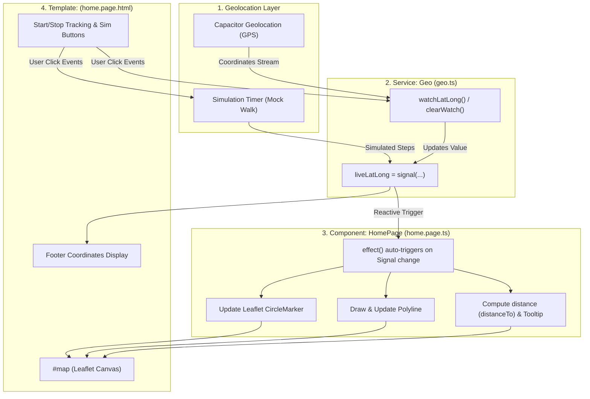

# Comprehensive Codebase Analysis & Architecture Guide

This document provides a deep, line-by-line analysis and architectural breakdown of the three core files powering the **Map-Geo Continuous Tracking** application:
1. [`src/app/services/geo.ts`](src/app/services/geo.ts) – Geolocation & Simulation Data Service
2. [`src/app/home/home.page.ts`](src/app/home/home.page.ts) – Component Logic, Leaflet Map & Reactive Effects
3. [`src/app/home/home.page.html`](src/app/home/home.page.html) – Mobile UI, Interactive Controls & Live Display

---

## 🏛️ High-Level Architecture & Data Flow

The application follows Angular's **Separation of Concerns** and **Reactive State Management** using modern Angular **Signals** and **Effects**:



---

## 1. 🛰️ Deep Dive: `src/app/services/geo.ts`

This service acts as the **single source of truth** for all location data, handling communication with the native device GPS hardware via `@capacitor/geolocation`, as well as managing the mock walking simulator.

### Key Members & Methods Breakdown:

#### A. Reactive State: `liveLatLong = signal<any>(null)`
* **What it is:** An Angular **Signal**.
* **Why it matters:** Unlike standard variables, when a Signal's value changes using `.set()`, Angular automatically notifies any `effect()` or UI template listening to it, triggering instantaneous, efficient UI updates without manual polling.

#### B. Active Watcher & Simulation Handles
```typescript
private watchId: string | null = null;
private simulationInterval: any = null;
```
* `watchId`: Stores the unique ID returned by `Geolocation.watchPosition()` so we can later cancel the watch.
* `simulationInterval`: Stores the JavaScript `setInterval` timer ID for the mock walking simulation.

#### C. `getLatLong()` – Initial Static Location
* **Method:** `Geolocation.getCurrentPosition({ enableHighAccuracy: true, timeout: 10000 })`
* **Purpose:** Fetches a **single snapshot** of the user's current GPS position when the app first loads.
* **Return Value:** An object `{ lat: number, lng: number }`. Used as the fixed **Starting Position** and the map's initial center point.

#### D. `watchLatLong()` – Continuous Real-Time Tracking
* **Method:** `Geolocation.watchPosition(options, callback)`
* **How it works:**
  1. Stops any running simulation to avoid conflicting position updates.
  2. Registers a persistent GPS listener with high accuracy.
  3. Every time the physical device moves, the callback fires with updated `position.coords`.
  4. Calls `this.liveLatLong.set({ lats, lngs })`, which reactively triggers the map update in `home.page.ts`.
  5. Stores and returns `this.watchId`.

#### E. `stopWatching()` – Stopping Real GPS
* **Method:** `Geolocation.clearWatch({ id: this.watchId })`
* **Why it is critical:** Releases the hardware GPS sensor on Android/iOS. If a watcher is not cleared, the device's battery will rapidly drain and GPS resources will leak in the background.

#### F. `simulateWalking()` & `stopSimulation()` – Lab Testing Tool
* **How it works:** Starts at a designated coordinate (or your starting position) and uses `setInterval` (every 1.5 seconds) to increment latitude and longitude by approx. ~8–10 meters per step with realistic heading jitter.
* **Purpose:** Allows full verification and demonstration of marker movement, polylines, and distance calculations even when you are sitting at your desk or testing on a simulator.

---

## 2. 🗺️ Deep Dive: `src/app/home/home.page.ts`

The component coordinates the Leaflet map lifecycle, listens reactively to location changes from the `Geo` service, updates visual map layers, and exposes button handlers.

### Key Sections Breakdown:

#### A. Standalone Component Imports & Injections
```typescript
imports: [IonHeader, IonToolbar, IonTitle, IonContent, IonFooter, IonAlert, IonButton],
```
* Injects `ChangeDetectorRef` (for immediate UI change detection) and `Geo` service via Angular's `inject(Geo)`.

#### B. Leaflet State Variables
* `map`: Leaflet `l.Map` instance.
* `startingPositionX`: Stores the fixed starting coordinates `{ lat, lng }`.
* `livePosition`: Stores the current live coordinates `{ lats, lngs }`.
* `liveMarker`: A `l.CircleMarker` representing the live moving position.
* `liveLine`: A `l.Polyline` connecting the starting point to the live point.

#### C. The Reactive `constructor()` and `effect()`
```typescript
constructor() {
  effect(() => {
    this.livePosition = this.geoService.liveLatLong();
    this.cdr.detectChanges();
    
    if (this.livePosition) {
      // 1. Update or create liveMarker
      // 2. Compute distance: convertedPos1.distanceTo(convertedPos2)
      // 3. Update or create liveLine
      // 4. Update permanent tooltip on the polyline with distance in meters
    }
  });
}
```
* **Why `effect()`?** An `effect()` runs automatically whenever `geoService.liveLatLong()` changes.
* **Marker Logic:** If `liveMarker` does not exist yet, it instantiates it with `l.circleMarker()`. If it already exists, it moves it smoothly via `liveMarker.setLatLng(...)`.
* **Distance Calculation:** `convertedPos1.distanceTo(convertedPos2)` calculates the real-world geodesic distance in **meters** using the Haversine formula built into Leaflet.
* **Polyline & Tooltip:** Updates `liveLine.setLatLngs([pos1, pos2])` and binds a tooltip (`liveLine.bindTooltip('${distance}m')`) floating above the path showing the exact distance walked.

#### D. `mapInit()` & `ngAfterViewInit()`
* `ngAfterViewInit()`: Async lifecycle hook that awaits `geoService.getLatLong()`. If GPS fails, it opens `<ion-alert>`. If successful, it stores `startingPositionX` and initializes the map.
* `mapInit()`:
  - Centers the Leaflet map on `[startingPositionX.lat, startingPositionX.lng]` at zoom level `19`.
  - Loads OpenStreetMap tile layer (`https://tile.openstreetmap.org/{z}/{x}/{y}.png`).
  - Draws a static marker at the initial location.
  - Runs `setInterval(() => this.map.invalidateSize(), 200)` to ensure the Leaflet map renders correctly across viewport changes on mobile.

#### E. Control Handlers (Separation of Concerns)
```typescript
startTracking()    -> this.geoService.watchLatLong()
stopTracking()     -> this.geoService.stopWatching()
startSimulation()  -> this.geoService.simulateWalking(...)
stopSimulation()   -> this.geoService.stopSimulation()
```
* Each UI button maps to a dedicated, decoupled method without mixing business logic into the view.

---

## 3. 📱 Deep Dive: `src/app/home/home.page.html`

The template provides an intuitive, phone-ready interface with three main zones:

```html
<!-- 1. Header -->
<ion-header> ... <ion-title>Continuous Geo Tracking</ion-title> </ion-header>

<!-- 2. Content Area -->
<ion-content>
  <!-- Leaflet Map Container -->
  <div id="map"></div>

  <!-- GPS Error Alert -->
  <ion-alert ...></ion-alert>

  <!-- Phone-Ready Control Panel -->
  <div class="control-panel">
    <!-- Real GPS Buttons -->
    <ion-button color="success" (click)="startTracking()">▶ Start Tracking</ion-button>
    <ion-button color="danger" (click)="stopTracking()">⏹ Stop Tracking</ion-button>

    <!-- Lab Simulation Buttons -->
    <ion-button color="tertiary" (click)="startSimulation()">▶ Start Sim</ion-button>
    <ion-button color="medium" (click)="stopSimulation()">⏹ Stop Sim</ion-button>
  </div>
</ion-content>

<!-- 3. Footer Readout -->
<ion-footer>
  <div class="footer-info">
    <div><strong>Starting Position:</strong> {{startingPositionX?.lat}}, {{startingPositionX?.lng}}</div>
    <div><strong>Live Position:</strong> {{livePosition?.lats}}, {{livePosition?.lngs}}</div>
  </div>
</ion-footer>
```

### UI Features:
1. **Interactive Leaflet Map (`#map`):** Occupies the upper screen, rendering the road map, markers, and distance line.
2. **Dedicated Control Buttons:**
   - **Green (Success):** Start real GPS monitoring (`watchPosition`).
   - **Red (Danger):** Stop real GPS monitoring (`clearWatch`).
   - **Blue (Tertiary):** Start mock walk simulation.
   - **Gray (Medium):** Stop mock walk simulation.
3. **Coordinate Status Bar:** Displays the numeric coordinates of both starting and live locations.

---

## 🎓 Summary of Key Concepts (For Your Video / Lab Defense)

| Concept | Explanation |
| :--- | :--- |
| **`getCurrentPosition()` vs `watchPosition()`** | `getCurrentPosition()` is a one-time async call returning a single coordinate snapshot. `watchPosition()` registers a continuous background stream that notifies a callback whenever the device's location changes. |
| **What `watchPosition()` returns** | It returns a `CallbackID` (string/number ID). This ID is the handle required to reference that specific watcher. |
| **Why `clearWatch()` is needed** | It unsubscribes from GPS events. Without it, the GPS hardware stays active, creating memory leaks and draining the phone's battery. |
| **Why Angular Signals & Effects are used** | Signals provide fine-grained reactivity. When `liveLatLong` updates in the service, the `effect()` in the component executes immediately, keeping the Leaflet map and UI in sync without performance overhead. |
