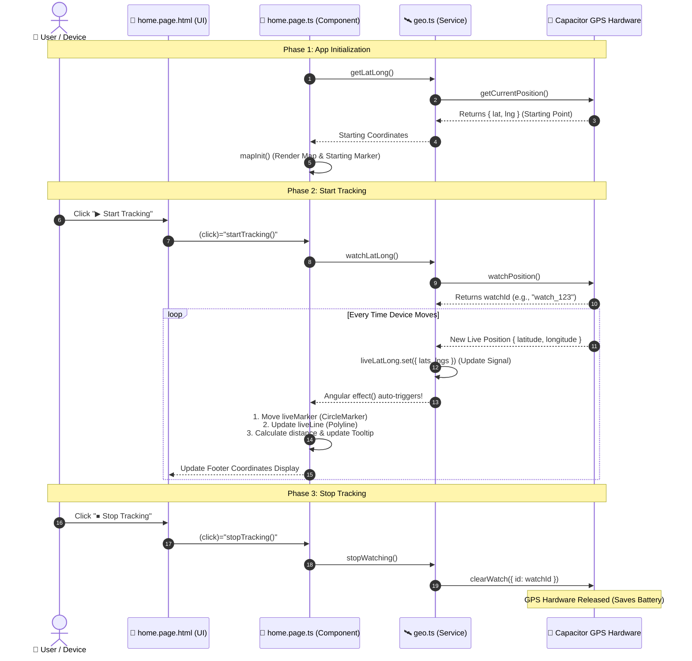

# 📑 Paliwanag at Pagsusuri ng 3 Pangunahing Files

Ang dokumentong ito ay naglalaman ng detalyadong paliwanag kung paano gumagana at nag-uusap ang tatlong (3) main files ng ating **Map-Geo Continuous Tracking App**:
1. [`src/app/services/geo.ts`](src/app/services/geo.ts) — **Data & Geolocation Service**
2. [`src/app/home/home.page.ts`](src/app/home/home.page.ts) — **Map Logic, Reactivity & Handlers**
3. [`src/app/home/home.page.html`](src/app/home/home.page.html) — **User Interface & Controls**

---

## 🔄 Paano Nag-uusap ang 3 Files (System Data Flow)



---

## 🛰️ 1. `src/app/services/geo.ts` (Data & Hardware Layer)

Ito ang **Service Layer** na may solong responsibilidad sa pakikipag-ugnayan sa GPS sensor ng device gamit ang `@capacitor/geolocation` at sa walking simulation.

### Mahahalagang Bahagi ng Code:

1. **`liveLatLong = signal<any>(null);`**
   * Gumagamit ng **Angular Signal**. 
   * Kapag nagbago ang value nito gamit ang `.set()`, kusa nitong inaabisuhan ang `home.page.ts` nang walang manual polling.

2. **`watchId: string | null = null;`**
   * Dito iniimbak ang ID na ibinabalik ng `watchPosition()`. Kailangan ito para malaman ng system kung aling GPS watcher ang ipapatigil.

3. **`getLatLong()` (One-time Snapshot)**
   * Tinatawag ang `Geolocation.getCurrentPosition()`.
   * Kinukuha lamang ang **unang posisyon** pagkabukas ng app upang gawing center ng mapa at starting point.

4. **`watchLatLong()` (Continuous Stream)**
   * Tinatawag ang `Geolocation.watchPosition()`.
   * Nagbubukas ng stream listener sa GPS. Sa bawat paghakbang ng user, tumatakbo ang callback at ina-update ang `liveLatLong` signal.

5. **`stopWatching()` (Resource Cleanup)**
   * Tinatawag ang `Geolocation.clearWatch({ id: this.watchId })`.
   * **Bakit kailangan?** Ipinapahinto nito ang paggamit sa GPS antenna ng phone upang makatipid sa baterya at maiwasan ang memory leak.

6. **`simulateWalking()` at `stopSimulation()`**
   * Gumagamit ng `setInterval` (bawat 1.5 seconds) upang magdagdag ng maliliit na coordinate steps (~8–10 meters) para sa testing kahit nakaupo o nasa loob ng silid.

---

## 🗺️ 2. `src/app/home/home.page.ts` (Map Controller & Logic)

Ito ang **Component Brain**. Dito pinapagana ang Leaflet Map, pinoproseso ang visual elements (markers, polylines), at kinakalkula ang distansya.

### Mahahalagang Bahagi ng Code:

1. **`effect(() => { ... })` sa `constructor()`**
   * Ang `effect()` ay nakikinig sa `geoService.liveLatLong()`.
   * **Awtomatikong tumatakbo** sa tuwing may bagong coordinate na dumarating:
     * **`liveMarker`:** Inililipat ang asul na marker sa bagong lokasyon gamit ang `.setLatLng()`.
     * **`distanceTo()`:** Kinakalkula ang distansya (sa metro) sa pagitan ng Starting Position at Live Position gamit ang geodesic formula ng Leaflet.
     * **`liveLine`:** Gumuguhit at nag-uupdate ng linya mula sa start papunta sa live point.
     * **`bindTooltip()`:** Naglalagay ng lumulutang na text sa ibabaw ng linya na nagpapakita ng distansya (hal. `25.30m`).

2. **`ngAfterViewInit()` at `mapInit()`**
   * Pagkatapos ma-load ng view, kinukuha ang starting position mula sa `geoService.getLatLong()`.
   * Sinisimulan ang Leaflet map (`l.map('map')`) na nakasentro sa starting coordinates na may zoom level na `19`.
   * Naglalagay ng OpenStreetMap tiles (`tileLayer`) at starting marker.

3. **Separation of Concerns (Button Handlers)**
   * `startTracking()` ➡️ Tumatawag sa `this.geoService.watchLatLong()`
   * `stopTracking()` ➡️ Tumatawag sa `this.geoService.stopWatching()`
   * `startSimulation()` ➡️ Tumatawag sa `this.geoService.simulateWalking(...)`
   * `stopSimulation()` ➡️ Tumatawag sa `this.geoService.stopSimulation()`

---

## 📱 3. `src/app/home/home.page.html` (View / UI Layer)

Ito ang **HTML Template** kung saan nakikipag-ugnayan ang user sa pamamagitan ng screen ng phone.

### Mahahalagang Bahagi ng UI:

1. **`<div id="map"></div>`**
   * Ang HTML container kung saan nire-render ng Leaflet library ang interactive map at mga tiles.

2. **Real GPS Control Buttons**
   ```html
   <ion-button color="success" (click)="startTracking()">▶ Start Tracking</ion-button>
   <ion-button color="danger" (click)="stopTracking()">⏹ Stop Tracking</ion-button>
   ```
   * Direktang nagti-trigger ng `startTracking()` at `stopTracking()` methods sa TypeScript file.

3. **Laboratory Simulation Buttons**
   ```html
   <ion-button color="tertiary" (click)="startSimulation()">▶ Start Sim</ion-button>
   <ion-button color="medium" (click)="stopSimulation()">⏹ Stop Sim</ion-button>
   ```
   * Nagpapagana ng mock walk para sa mabilisang demo at testing.

4. **`<ion-footer>` Status Readout**
   ```html
   <div>Starting Position: {{startingPositionX?.lat}}, {{startingPositionX?.lng}}</div>
   <div>Live Position: {{livePosition?.lats}}, {{livePosition?.lngs}}</div>
   ```
   * Gamit ang Angular Interpolation (`{{ }}`), real-time na ipinapakita ang eksaktong numerical values ng Latitude at Longitude.

---

## 🎤 Mabilisang Script / Guide Para sa Video Presentation

Kung ipapaliwanag mo ito sa video, sundin lamang ang simpleng pagkakasunod-sunod na ito:

> 1. **Panimula:**
> *"Magandang araw po! Ngayon po ay ipapakita ko ang aming Continuous Geolocation Tracking app gamit ang Capacitor Geolocation at Leaflet Maps."*
>
> 2. **Code Walkthrough (3 Files):**
> * **`geo.ts`:** *"Una, sa `geo.ts`, narito ang aming service layer. Ginagamit natin ang `watchPosition()` para mag-stream ng GPS updates sa ating `liveLatLong` signal, at `clearWatch()` gamit ang `watchId` kapag pinindot ang stop."*
> * **`home.page.ts`:** *"Pangalawa, sa `home.page.ts`, mayroon tayong Angular `effect()`. Kapag may bagong data ang signal, kusa nitong inililipat ang blue marker, kinakalkula ang distansya gamit ang `distanceTo()`, at ina-update ang polyline."*
> * **`home.page.html`:** *"Pangatlo, sa `home.page.html`, nandito ang ating map container, ang mga buttons para sa Start at Stop tracking, pati ang numerical coordinates display sa footer."*
>
> 3. **Live Demo:**
> *"Pindutin natin ang Start Tracking / Start Sim... makikita po nating gumagalaw ang marker, humahaba ang linya, at nag-uupdate ang distansya. Kapag pinindot ang Stop, matagumpay na natitigil ang GPS watcher."*
